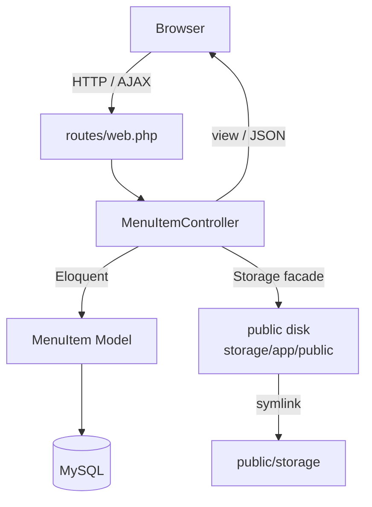
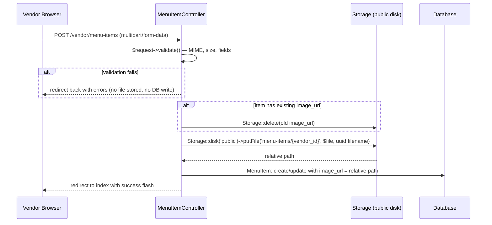
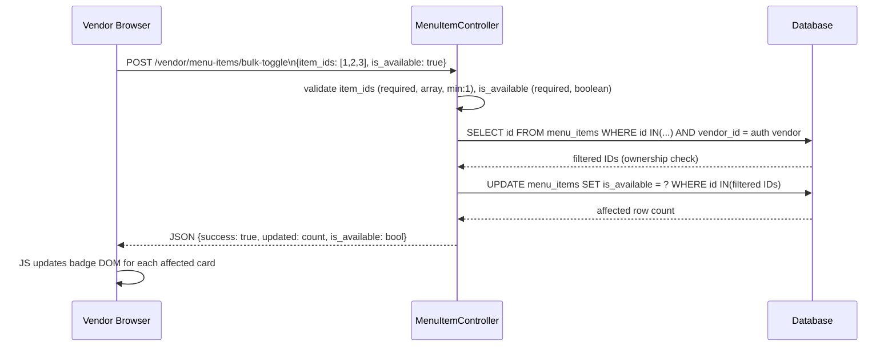
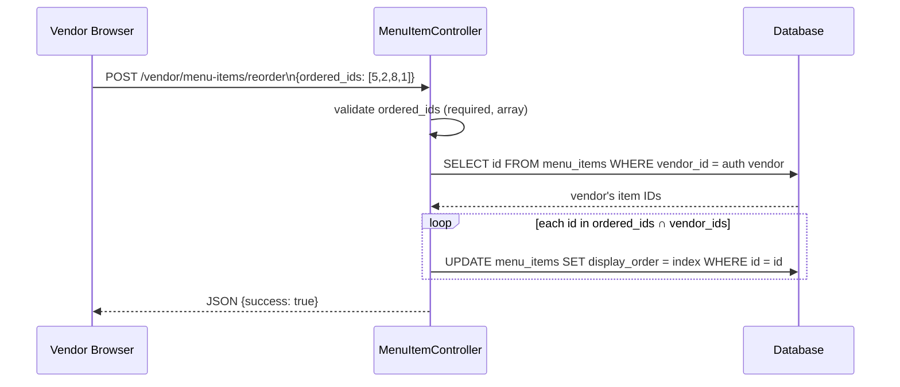

# Design Document: Enhanced Vendor Menu Management

## Overview

This feature wires up the already-migrated extended columns on the `menu_items` table and adds five new capabilities to the CampusEats vendor dashboard: food photo uploads, custom categories, bulk availability toggling, drag-and-drop display ordering, and real food photos on the student-facing menu page. Vendor dashboard views are also re-themed from indigo/purple to the app's brown brand color (`#724e2c` / `#563517`).

The implementation is entirely within the existing Laravel 12 MVC structure. No new packages are required beyond SortableJS (CDN) for drag-and-drop. All new server-side logic lives in `MenuItemController` and the `MenuItem` model. Two new AJAX endpoints are added to `routes/web.php`.

---

## Architecture

The feature follows the existing request lifecycle: browser → `routes/web.php` → `MenuItemController` → `MenuItem` model → database / `Storage` facade → JSON or redirect response → Blade view.



### New AJAX Endpoints

| Method | URI | Controller Method | Purpose |
|--------|-----|-------------------|---------|
| POST | `/vendor/menu-items/bulk-toggle` | `bulkToggle` | Toggle `is_available` on multiple items |
| POST | `/vendor/menu-items/reorder` | `reorder` | Save drag-and-drop display order |

These two routes must be registered **before** the `Route::resource()` call to avoid the `{menuItem}` wildcard capturing `bulk-toggle` and `reorder` as IDs.

### Modified Endpoints

| Method | URI | Change |
|--------|-----|--------|
| POST | `/vendor/menu-items` | Add image upload + custom_category handling |
| PUT | `/vendor/menu-items/{menuItem}` | Add image replacement + custom_category handling |

---

## Components and Interfaces

### MenuItem Model (`app/Models/MenuItem.php`)

Add to `$fillable`:
- `image_url`, `custom_category`, `display_order`

Add computed accessor `effective_category`:
```php
public function getEffectiveCategoryAttribute(): ?string
{
    return (isset($this->custom_category) && $this->custom_category !== '')
        ? $this->custom_category
        : $this->category;
}
```

Add `display_order` cast as `integer`.

### MenuItemController (`app/Http/Controllers/MenuItemController.php`)

Existing methods modified:
- `store()` — add image upload logic, custom_category, display_order assignment
- `update()` — add image replacement logic (delete old → store new), custom_category
- `index()` — change query to order by `display_order` ASC, grouped by `effective_category`

New methods:
- `bulkToggle(Request $request): JsonResponse`
- `reorder(Request $request): JsonResponse`

Private helper:
- `handleImageUpload(Request $request, MenuItem $item): void` — encapsulates store/replace logic

### Blade Views

| File | Changes |
|------|---------|
| `vendor/menu-items/index.blade.php` | Brown theme, checkboxes, bulk action bar, drag handles, SortableJS init |
| `vendor/menu-items/create.blade.php` | Brown theme, image file input with preview, custom category UI |
| `vendor/menu-items/edit.blade.php` | Brown theme, image file input with current image preview, custom category UI |
| `students/vendor.blade.php` | Real image rendering with emoji fallback, group by effective_category, sort by display_order |

### JavaScript (`resources/js/menu-items.js`)

Existing file extended with:
- `initBulkToggle()` — checkbox selection, bulk action bar show/hide, AJAX call to `bulk-toggle`
- `initSortable()` — SortableJS initialization per category group, AJAX call to `reorder`
- `initCategoryToggle()` — show/hide custom category text input when "Custom..." is selected
- `initImagePreview()` — live preview of selected image file before upload

---

## Data Models

### `menu_items` table (complete schema)

| Column | Type | Nullable | Default | Notes |
|--------|------|----------|---------|-------|
| `id` | bigint unsigned | no | auto | PK |
| `vendor_id` | bigint unsigned | no | — | FK → vendors.id CASCADE |
| `name` | varchar(255) | no | — | |
| `description` | text | yes | null | |
| `price` | decimal(8,2) | no | — | |
| `is_available` | boolean | no | true | |
| `category` | varchar(255) | yes | null | Preset dropdown value |
| `custom_category` | varchar(255) | yes | null | Vendor-typed value |
| `image_url` | varchar(255) | yes | null | Relative path on public disk |
| `tags` | json | yes | null | Not used in this feature |
| `preparation_time` | integer | yes | null | Not used in this feature |
| `is_spicy` | boolean | no | false | Not used in this feature |
| `is_vegetarian` | boolean | no | false | Not used in this feature |
| `is_featured` | boolean | no | false | Not used in this feature |
| `stock_quantity` | integer | yes | null | Not used in this feature |
| `customization_options` | json | yes | null | Not used in this feature |
| `allergen_info` | text | yes | null | Not used in this feature |
| `calories` | integer | yes | null | Not used in this feature |
| `display_order` | integer | no | 0 | Sort position within category |
| `created_at` | timestamp | yes | null | |
| `updated_at` | timestamp | yes | null | |

**Effective Category Logic** (computed, not stored):
```
effective_category = custom_category ?? category
```

No new migrations are needed — all columns are already present.

### Image Storage Layout

```
storage/app/public/
└── menu-items/
    └── {vendor_id}/
        └── {uuid}.{ext}   ← e.g. a3f2c1d0-....jpg
```

Public URL: `Storage::url("menu-items/{vendor_id}/{uuid}.{ext}")`
→ resolves to `http://app.test/storage/menu-items/{vendor_id}/{uuid}.{ext}`

---

## Data Flow Diagrams

### Image Upload Flow



### Bulk Toggle Flow



### Reorder Flow



---

## API Endpoints

### Existing (modified)

**POST `/vendor/menu-items`** — store
- New fields accepted: `image` (file), `custom_category` (string)
- Validation additions: `image` nullable|file|mimes:jpeg,png,gif,webp|max:2048, `custom_category` nullable|string|max:100
- Side effect: stores image file if present

**PUT `/vendor/menu-items/{menuItem}`** — update
- Same new fields and validation as store
- Side effect: deletes old image file if a new one is uploaded

### New

**POST `/vendor/menu-items/bulk-toggle`**

Request body:
```json
{ "item_ids": [1, 2, 3], "is_available": true }
```

Validation:
- `item_ids`: required, array, min:1
- `item_ids.*`: integer, exists:menu_items,id
- `is_available`: required, boolean

Success response (200):
```json
{ "success": true, "updated": 3, "is_available": true }
```

Error response (422):
```json
{ "message": "The item ids field is required.", "errors": { "item_ids": [...] } }
```

**POST `/vendor/menu-items/reorder`**

Request body:
```json
{ "ordered_ids": [5, 2, 8, 1] }
```

Validation:
- `ordered_ids`: required, array
- `ordered_ids.*`: integer

Success response (200):
```json
{ "success": true }
```

---

## Frontend JavaScript Architecture

All vendor-side JS lives in `resources/js/menu-items.js` (already exists). The file is extended with four initialization functions called on `DOMContentLoaded`.

### `initCategoryToggle()`

Watches the `#category` select. When value is `"__custom__"`, reveals `#custom-category-wrapper` (a text input). When any other value is selected, hides it and clears the text input. This is pure DOM manipulation, no AJAX.

### `initImagePreview()`

Watches the `#image` file input. On change, reads the file with `FileReader` and sets the `src` of `#image-preview`. Shows a remove button that clears the input and hides the preview.

### `initBulkToggle()`

- Renders a bulk action bar (hidden by default) above the item grid
- Watches all `.item-checkbox` inputs; shows/hides the bar based on selection count
- "Select All" / "Deselect All" buttons
- "Mark Available" / "Mark Unavailable" buttons POST to `/vendor/menu-items/bulk-toggle` via `fetch`
- On success, iterates response IDs and updates each card's badge class and button text in the DOM without reload

### `initSortable()`

- Loads SortableJS from CDN (or bundled)
- For each `.sortable-category-group` container, initializes a `Sortable` instance with `handle: '.drag-handle'`
- On `onEnd` event, collects the new ordered IDs from the container's `data-id` attributes and POSTs to `/vendor/menu-items/reorder`
- Shows a brief "Order saved" toast on success

### CSRF Token

All `fetch` calls include the CSRF token from `document.querySelector('meta[name="csrf-token"]').content` in the `X-CSRF-TOKEN` header.

---

## UI Wireframes (Text Descriptions)

### Vendor Menu Index — Enhanced

```
┌─────────────────────────────────────────────────────────────┐
│ NAV: [brown border] CampusEats | Dashboard | Menu Items | …  │
├─────────────────────────────────────────────────────────────┤
│ HEADER: [brown gradient] Menu Items          [+ Add Item]    │
├─────────────────────────────────────────────────────────────┤
│ STATS: Total | Available | Unavailable | Categories          │
├─────────────────────────────────────────────────────────────┤
│ BULK BAR (hidden until ≥1 checkbox checked):                 │
│  [✓ 2 selected]  [Mark Available] [Mark Unavailable] [Clear] │
├─────────────────────────────────────────────────────────────┤
│ CATEGORY: Rice Meals ──────────────────────────────────────  │
│  ┌──────────────┐  ┌──────────────┐  ┌──────────────┐       │
│  │ [☐] [≡drag]  │  │ [☐] [≡drag]  │  │ [☐] [≡drag]  │       │
│  │ [food image] │  │ [food image] │  │ [emoji]      │       │
│  │ Item Name    │  │ Item Name    │  │ Item Name    │       │
│  │ ₱65.00       │  │ ₱70.00       │  │ ₱55.00       │       │
│  │ [Toggle][Edit][Del] │ ...      │  │ ...          │       │
│  └──────────────┘  └──────────────┘  └──────────────┘       │
└─────────────────────────────────────────────────────────────┘
```

### Create/Edit Form — Enhanced

```
┌─────────────────────────────────────────────────────────────┐
│ Item Name *  [________________________]                      │
│ Description  [________________________]                      │
│ Price (₱) *  [_______]  Category [dropdown ▼]               │
│                          └─ if "Custom..." selected:         │
│                             Custom Category [____________]   │
│ Image        [Choose File]  [current image preview if edit]  │
│ ☑ Item is available for ordering                             │
│ [Save Item (brown button)]  [Cancel]                         │
└─────────────────────────────────────────────────────────────┘
```

### Student Vendor Page — Enhanced Item Card

```
┌──────────────────────┐
│ [real photo / emoji] │  ← 16:9, object-fit: cover
│ AVAILABLE badge      │
│ Item Name overlay    │
├──────────────────────┤
│ Description text     │
│ ₱65.00               │
│ [-] [qty] [+] [Add]  │
└──────────────────────┘
```

---

## Correctness Properties

*A property is a characteristic or behavior that should hold true across all valid executions of a system — essentially, a formal statement about what the system should do. Properties serve as the bridge between human-readable specifications and machine-verifiable correctness guarantees.*

### Property 1: Image Upload Round-Trip

*For any* valid image file (JPEG, PNG, GIF, or WebP, ≤ 2 MB) uploaded for a MenuItem, after the store or update request completes: `image_url` on the MenuItem is non-null, and `Storage::exists(image_url)` returns true. Furthermore, when a replacement image is uploaded for an item that already has an `image_url`, the old path no longer exists on the public disk after the update.

**Validates: Requirements 1.1, 1.3, 1.6**

### Property 2: Image Preservation on No-Upload

*For any* MenuItem with a non-null `image_url`, submitting an update request without an image file attached leaves `image_url` unchanged.

**Validates: Requirements 1.2**

### Property 3: MIME Type Validation

*For any* uploaded file whose MIME type is not one of `image/jpeg`, `image/png`, `image/gif`, `image/webp`, the store or update request returns a validation error, no file is written to disk, and the MenuItem record is not modified.

**Validates: Requirements 1.4, 1.7**

### Property 4: File Size Validation

*For any* uploaded file whose size exceeds 2 MB (2048 KB), the store or update request returns a validation error, no file is written to disk, and the MenuItem record is not modified.

**Validates: Requirements 1.5**

### Property 5: Effective Category Invariant

*For any* MenuItem created or updated with arbitrary combinations of `category` (nullable string) and `custom_category` (nullable string): the `effective_category` accessor returns `custom_category` when `custom_category` is non-null and non-empty, and returns `category` otherwise. This invariant holds after every create and update operation.

**Validates: Requirements 2.3, 2.5, 2.6**

### Property 6: Effective Category Validation

*For any* store or update request where both `category` and `custom_category` are null or empty strings, the controller returns a validation error and does not write to the database.

**Validates: Requirements 2.4**

### Property 7: Bulk Toggle Correctness and Count

*For any* set S of MenuItem IDs and a target availability state X, after a bulk toggle request: every item whose ID is in S ∩ vendor_item_ids has `is_available == X`, every item whose ID is not in S retains its original `is_available` value, and the response `updated` count equals |S ∩ vendor_item_ids|.

**Validates: Requirements 3.3, 3.7**

### Property 8: Bulk Toggle Ownership Isolation

*For any* bulk toggle request containing MenuItem IDs that do not belong to the authenticated vendor, those items are not modified and the response still returns HTTP 200 with a count reflecting only the vendor's own items.

**Validates: Requirements 3.4**

### Property 9: Display Order Round-Trip

*For any* permutation P of a vendor's MenuItem IDs submitted to the reorder endpoint, fetching the vendor's items sorted by `display_order` ASC after the save returns items in the same sequence as P.

**Validates: Requirements 4.3, 4.5, 4.7**

### Property 10: Display Order Set Invariant

*For any* reorder operation, the set of MenuItem IDs belonging to the vendor is identical before and after the operation — only `display_order` values change; no items are created or deleted.

**Validates: Requirements 4.4, 4.6**

### Property 11: Item Image Rendering

*For any* MenuItem, the student-facing vendor page renders an `` element with `src = Storage::url(image_url)` when `image_url` is non-null, and renders the category emoji placeholder when `image_url` is null.

**Validates: Requirements 5.1, 5.2**

### Property 12: Field Validation

*For any* store or update request, submitting invalid values for any field (name empty, price ≤ 0, price > 99999.99, name > 255 chars, description > 1000 chars, category > 100 chars, custom_category > 100 chars, display_order < 0 or non-integer) returns a validation error and does not write to the database.

**Validates: Requirements 7.1, 7.3**

### Property 13: Ownership Authorization

*For any* mutating request (update, destroy, toggleAvailability, bulkToggle, reorder) targeting a MenuItem whose `vendor_id` does not match the authenticated vendor's id, the controller returns HTTP 403 and does not modify any data.

**Validates: Requirements 7.2**

### Property 14: Unique Filename Generation

*For any* two image upload operations (even with the same source file), the resulting `image_url` values stored in the database are distinct — no two uploads produce the same filename.

**Validates: Requirements 7.4**

---

## Error Handling

### Validation Errors

All validation is performed via `$request->validate()` before any file I/O or database write. Laravel's default behavior redirects back with `$errors` bag for form submissions and returns a 422 JSON response for AJAX requests. No special handling needed.

### File Storage Errors

The `public` disk is configured with `'throw' => false`, meaning `Storage::put()` returns `false` on failure rather than throwing. The controller checks the return value:

```php
$path = Storage::disk('public')->putFileAs(
    "menu-items/{$vendor->id}",
    $request->file('image'),
    Str::uuid() . '.' . $request->file('image')->extension()
);

if ($path === false) {
    return back()->withErrors(['image' => 'Failed to store image. Please try again.']);
}
```

### Old File Deletion Failure

If `Storage::disk('public')->delete($oldPath)` returns false (e.g., file already missing), the controller logs a warning but continues — the new file is still stored and `image_url` is updated. A missing old file is not a fatal error.

### Bulk Toggle — Partial Ownership

If none of the submitted IDs belong to the vendor, the endpoint returns `{"success": true, "updated": 0}` with HTTP 200. The frontend shows "0 items updated" in the toast.

### Reorder — Foreign IDs

IDs in `ordered_ids` that do not belong to the vendor are silently ignored. Only vendor-owned IDs are updated.

### 403 Unauthorized

All ownership checks use `abort(403)` for form requests and `response()->json(['error' => 'Unauthorized'], 403)` for AJAX endpoints.

---

## Security Considerations

1. **Ownership verification** on every mutating operation — `vendor_id` check before any write.
2. **MIME type validation** uses Laravel's `mimes:` rule which checks the actual file content (via `finfo`), not just the extension.
3. **UUID filenames** via `Str::uuid()` prevent filename collisions and path traversal attacks — user-supplied filenames are never used.
4. **File size limit** of 2 MB (2048 KB) prevents storage exhaustion.
5. **CSRF protection** on all POST/PUT/DELETE routes via Laravel's middleware; AJAX calls include `X-CSRF-TOKEN` header.
6. **Mass assignment protection** — only explicitly listed `$fillable` fields are accepted by Eloquent.
7. **SQL injection** — all queries use Eloquent's parameterized bindings; the `whereIn` in `bulkToggle` uses bound parameters.
8. **Bulk toggle ID validation** — `exists:menu_items,id` rule ensures submitted IDs reference real records before the ownership filter runs.

---

## Testing Strategy

### Unit Tests (`tests/Unit/`)

- `MenuItemEffectiveCategoryTest` — tests the `effective_category` accessor with various `category`/`custom_category` combinations
- `ImageUploaderTest` — tests filename generation uniqueness, MIME validation logic in isolation

### Feature Tests (`tests/Feature/`)

- `MenuItemStoreTest` — tests store with/without image, with/without custom_category, invalid inputs
- `MenuItemUpdateTest` — tests update with image replacement, image preservation, ownership check
- `BulkToggleTest` — tests bulk toggle with owned IDs, foreign IDs, empty array, count correctness
- `ReorderTest` — tests reorder round-trip, set invariant, foreign ID isolation
- `StudentVendorPageTest` — tests image rendering vs emoji fallback, grouping and sort order

### Property-Based Tests

The project uses PHPUnit 11.5 (already installed). Property-based tests are implemented using PHPUnit data providers with `Faker` for random input generation, running a minimum of 100 iterations per property via a loop inside the test method. Each test is tagged with a comment referencing the design property.

**Tag format:** `// Feature: enhanced-vendor-menu-management, Property {N}: {property_text}`

Example structure:

```php
/** @test */
public function property5_effective_category_invariant(): void
{
    // Feature: enhanced-vendor-menu-management, Property 5: Effective Category Invariant
    $faker = \Faker\Factory::create();
    for ($i = 0; $i < 100; $i++) {
        $category = $faker->randomElement([null, 'Rice Meals', 'Snacks', '']);
        $customCategory = $faker->randomElement([null, '', $faker->word()]);
        $item = MenuItem::factory()->create([
            'category' => $category,
            'custom_category' => $customCategory,
        ]);
        $expected = ($customCategory !== null && $customCategory !== '')
            ? $customCategory
            : $category;
        $this->assertEquals($expected, $item->effective_category);
    }
}
```

Each of the 14 correctness properties maps to exactly one property-based test method. Unit tests cover specific examples and edge cases (e.g., price = 0, empty name, exact 2 MB boundary). Property tests cover the universal rules across randomized inputs.
