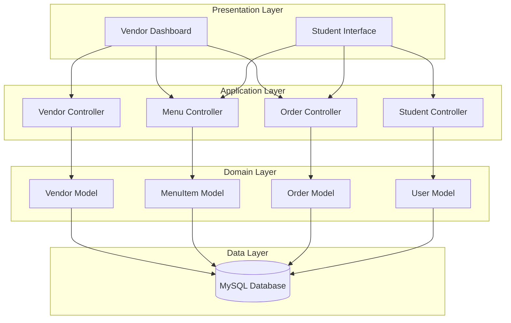

# Design Document: Vendor Menu System

## Overview

The Vendor Menu System is a Laravel 12 web application that enables food vendors within a school to manage their menus and allows students to browse, order, and receive notifications when orders are ready. The system follows Laravel's MVC architecture with Eloquent ORM for data persistence, Blade templates for views, and RESTful routing patterns.

The application supports two primary user roles:
- **Vendors**: Manage menu items, update availability, and process orders
- **Students**: Browse menus, place orders, and receive pickup notifications

The system emphasizes real-time availability updates and streamlined order management to eliminate intermediary systems and enable direct vendor-student transactions.

## Architecture

### High-Level Architecture



### Technology Stack

- **Backend Framework**: Laravel 12 (PHP 8.2+)
- **Database**: MySQL/MariaDB with Eloquent ORM
- **Frontend**: Blade templates with Tailwind CSS 4.0
- **Asset Compilation**: Vite 7.0
- **Authentication**: Laravel's built-in authentication system
- **Testing**: PHPUnit 11.5 with Laravel testing utilities

### Design Patterns

- **MVC Pattern**: Separation of concerns between models, views, and controllers
- **Repository Pattern**: Eloquent models serve as repositories for data access
- **Service Layer**: Business logic encapsulated in controller methods
- **Policy Pattern**: Authorization logic for vendor and student actions

## Components and Interfaces

### Models

#### User Model
Extends Laravel's Authenticatable base class to support both vendors and students.

```php
class User extends Authenticatable
{
    protected $fillable = ['name', 'email', 'password', 'role'];
    protected $hidden = ['password', 'remember_token'];
    protected $casts = [
        'email_verified_at' => 'datetime',
        'password' => 'hashed',
    ];
    
    // Relationships
    public function vendor(): HasOne;
    public function orders(): HasMany;
    
    // Role checking
    public function isVendor(): bool;
    public function isStudent(): bool;
}
```

#### Vendor Model
Represents a food vendor with profile and location information.

```php
class Vendor extends Model
{
    protected $fillable = ['user_id', 'vendor_name', 'location', 'contact_info', 'description'];
    
    // Relationships
    public function user(): BelongsTo;
    public function menuItems(): HasMany;
    public function orders(): HasMany;
}
```

#### MenuItem Model
Represents individual food/beverage items offered by vendors.

```php
class MenuItem extends Model
{
    protected $fillable = [
        'vendor_id', 
        'name', 
        'description', 
        'price', 
        'is_available',
        'category'
    ];
    
    protected $casts = [
        'price' => 'decimal:2',
        'is_available' => 'boolean',
    ];
    
    // Relationships
    public function vendor(): BelongsTo;
    public function orderItems(): HasMany;
    
    // Scopes
    public function scopeAvailable($query);
    public function scopeForDate($query, $date);
}
```

#### Order Model
Represents student orders with status tracking.

```php
class Order extends Model
{
    protected $fillable = [
        'user_id',
        'vendor_id', 
        'order_number',
        'status',
        'total_amount',
        'notes'
    ];
    
    protected $casts = [
        'total_amount' => 'decimal:2',
        'created_at' => 'datetime',
        'updated_at' => 'datetime',
    ];
    
    // Relationships
    public function user(): BelongsTo;
    public function vendor(): BelongsTo;
    public function orderItems(): HasMany;
    
    // Status constants
    const STATUS_PENDING = 'pending';
    const STATUS_READY = 'ready';
    const STATUS_COMPLETED = 'completed';
    const STATUS_CANCELLED = 'cancelled';
    
    // Scopes
    public function scopePending($query);
    public function scopeReady($query);
    public function scopeCompleted($query);
}
```

#### OrderItem Model
Represents individual items within an order.

```php
class OrderItem extends Model
{
    protected $fillable = [
        'order_id',
        'menu_item_id',
        'quantity',
        'price_at_order',
        'item_name'
    ];
    
    protected $casts = [
        'quantity' => 'integer',
        'price_at_order' => 'decimal:2',
    ];
    
    // Relationships
    public function order(): BelongsTo;
    public function menuItem(): BelongsTo;
}
```

### Controllers

#### VendorController
Handles vendor dashboard and profile management.

```php
class VendorController extends Controller
{
    public function dashboard(): View;
    public function profile(): View;
    public function updateProfile(Request $request): RedirectResponse;
}
```

#### MenuItemController
Manages menu item CRUD operations.

```php
class MenuItemController extends Controller
{
    public function index(): View;
    public function create(): View;
    public function store(Request $request): RedirectResponse;
    public function edit(MenuItem $menuItem): View;
    public function update(Request $request, MenuItem $menuItem): RedirectResponse;
    public function destroy(MenuItem $menuItem): RedirectResponse;
    public function toggleAvailability(MenuItem $menuItem): JsonResponse;
}
```

#### OrderController
Handles order placement and status management.

```php
class OrderController extends Controller
{
    // Student actions
    public function index(): View;
    public function store(Request $request): RedirectResponse;
    public function show(Order $order): View;
    
    // Vendor actions
    public function vendorOrders(): View;
    public function updateStatus(Request $request, Order $order): RedirectResponse;
    public function markReady(Order $order): RedirectResponse;
    public function markCompleted(Order $order): RedirectResponse;
}
```

#### StudentController
Manages student menu browsing and order viewing.

```php
class StudentController extends Controller
{
    public function index(): View;
    public function showVendor(Vendor $vendor): View;
    public function search(Request $request): View;
    public function myOrders(): View;
}
```

### Routes

```php
// Public routes
Route::get('/', [StudentController::class, 'index'])->name('home');
Route::get('/vendors/{vendor}', [StudentController::class, 'showVendor'])->name('vendors.show');
Route::get('/search', [StudentController::class, 'search'])->name('search');

// Authentication routes
Auth::routes();

// Student routes (authenticated)
Route::middleware(['auth', 'student'])->group(function () {
    Route::get('/my-orders', [StudentController::class, 'myOrders'])->name('orders.my');
    Route::post('/orders', [OrderController::class, 'store'])->name('orders.store');
    Route::get('/orders/{order}', [OrderController::class, 'show'])->name('orders.show');
});

// Vendor routes (authenticated)
Route::middleware(['auth', 'vendor'])->prefix('vendor')->name('vendor.')->group(function () {
    Route::get('/dashboard', [VendorController::class, 'dashboard'])->name('dashboard');
    Route::resource('menu-items', MenuItemController::class);
    Route::post('/menu-items/{menuItem}/toggle', [MenuItemController::class, 'toggleAvailability'])
        ->name('menu-items.toggle');
    Route::get('/orders', [OrderController::class, 'vendorOrders'])->name('orders');
    Route::post('/orders/{order}/ready', [OrderController::class, 'markReady'])->name('orders.ready');
    Route::post('/orders/{order}/complete', [OrderController::class, 'markCompleted'])
        ->name('orders.complete');
});
```

### Middleware

#### RoleMiddleware
Ensures users have appropriate roles for accessing routes.

```php
class RoleMiddleware
{
    public function handle(Request $request, Closure $next, string $role): Response
    {
        if (!$request->user() || $request->user()->role !== $role) {
            abort(403, 'Unauthorized access');
        }
        return $next($request);
    }
}
```

## Data Models

### Database Schema

```mermaid
erDiagram
    users ||--o| vendors : "has one"
    users ||--o{ orders : "places many"
    vendors ||--o{ menu_items : "offers many"
    vendors ||--o{ orders : "receives many"
    orders ||--o{ order_items : "contains many"
    menu_items ||--o{ order_items : "included in many"
    
    users {
        bigint id PK
        string name
        string email UK
        string password
        string role
        timestamp email_verified_at
        timestamps
    }
    
    vendors {
        bigint id PK
        bigint user_id FK
        string vendor_name
        string location
        string contact_info
        text description
        timestamps
    }
    
    menu_items {
        bigint id PK
        bigint vendor_id FK
        string name
        text description
        decimal price
        boolean is_available
        string category
        timestamps
    }
    
    orders {
        bigint id PK
        bigint user_id FK
        bigint vendor_id FK
        string order_number UK
        string status
        decimal total_amount
        text notes
        timestamps
    }
    
    order_items {
        bigint id PK
        bigint order_id FK
        bigint menu_item_id FK
        integer quantity
        decimal price_at_order
        string item_name
        timestamps
    }
```

### Validation Rules

#### MenuItem Validation
```php
[
    'name' => 'required|string|max:255',
    'description' => 'nullable|string|max:1000',
    'price' => 'required|numeric|min:0|max:99999.99',
    'is_available' => 'boolean',
    'category' => 'nullable|string|max:100',
]
```

#### Order Validation
```php
[
    'vendor_id' => 'required|exists:vendors,id',
    'items' => 'required|array|min:1',
    'items.*.menu_item_id' => 'required|exists:menu_items,id',
    'items.*.quantity' => 'required|integer|min:1|max:99',
    'notes' => 'nullable|string|max:500',
]
```

#### Vendor Profile Validation
```php
[
    'vendor_name' => 'required|string|max:255',
    'location' => 'required|string|max:255',
    'contact_info' => 'nullable|string|max:255',
    'description' => 'nullable|string|max:1000',
]
```

### Data Flow

#### Order Placement Flow
1. Student browses available menu items
2. Student adds items to cart (session-based)
3. Student submits order with selected items
4. System validates item availability
5. System creates Order record with unique order_number
6. System creates OrderItem records for each item
7. System calculates total_amount
8. System returns order confirmation

#### Order Status Update Flow
1. Vendor views pending orders
2. Vendor marks order as ready
3. System updates order status to 'ready'
4. System triggers notification display for student
5. Student views ready orders on dashboard
6. Vendor marks order as completed when picked up
7. System updates order status to 'completed'

## Correctness Properties


*A property is a characteristic or behavior that should hold true across all valid executions of a system—essentially, a formal statement about what the system should do. Properties serve as the bridge between human-readable specifications and machine-verifiable correctness guarantees.*

### Property 1: Vendor Registration Creates Unique Accounts

*For any* valid vendor registration data (name, email, password, vendor details), when a vendor registers, the system should create a vendor account with a unique identifier and all profile information should be stored and retrievable.

**Validates: Requirements 1.1, 1.4**

### Property 2: Authentication Correctness

*For any* vendor account, authentication should succeed with valid credentials and fail with invalid credentials, returning appropriate error messages.

**Validates: Requirements 1.2, 1.3**

### Property 3: Menu Item CRUD Operations Persist Correctly

*For any* menu item with valid data (name, description, price, availability), creating, updating, or deleting the item should immediately persist the changes to the database, and the item should be retrievable with all fields intact after creation or update, and not retrievable after deletion.

**Validates: Requirements 2.1, 2.2, 2.3, 11.1**

### Property 4: Availability Toggle Reflects in Student Views

*For any* menu item, when a vendor toggles the availability status, the change should be immediately visible in student views with unavailable items clearly marked as such.

**Validates: Requirements 2.4, 2.5, 3.2, 5.1, 5.2**

### Property 5: Published Menus Are Visible to Students

*For any* vendor with menu items, when the vendor has published menu items, all items should be visible in the student browsing interface with complete information (name, description, price, availability).

**Validates: Requirements 3.1, 4.1, 4.2**

### Property 6: Multiple Menu Items Can Be Managed

*For any* vendor, the system should support creating, updating, and managing multiple menu items simultaneously, with each item maintaining its own state independently.

**Validates: Requirements 3.3**

### Property 7: Available and Unavailable Items Are Distinguished

*For any* set of menu items with mixed availability statuses, when displayed to students, available and unavailable items should be clearly distinguishable in the data model.

**Validates: Requirements 4.3**

### Property 8: Menu Item Timestamps Are Tracked

*For any* menu item, the system should track and display the last update timestamp whenever the item is modified.

**Validates: Requirements 5.4**

### Property 9: Vendor Information Completeness

*For any* vendor, when displaying vendor information to students, the system should include the vendor's location, and optionally include contact information if provided.

**Validates: Requirements 6.1, 6.2, 6.3**

### Property 10: Search Returns Matching Items

*For any* search term and collection of menu items, the search should return all and only those items where the term matches the item name or description.

**Validates: Requirements 7.1**

### Property 11: Vendor Filtering Works Correctly

*For any* vendor filter selection and collection of menu items from multiple vendors, filtering should return all and only the menu items belonging to the selected vendor.

**Validates: Requirements 7.2**

### Property 12: Availability Filtering Works Correctly

*For any* availability filter selection (available/unavailable) and collection of menu items, filtering should return all and only the items matching the selected availability status.

**Validates: Requirements 7.3**

### Property 13: Order Creation Stores Complete Information

*For any* valid order with available menu items, when a student places an order, the system should create an order record containing student information, vendor, all ordered items with quantities, total amount, and timestamp.

**Validates: Requirements 8.1**

### Property 14: Order Numbers Are Unique

*For any* set of orders, each order should have a unique order number that can be used for tracking.

**Validates: Requirements 8.2**

### Property 15: Unavailable Items Cannot Be Ordered

*For any* menu item marked as unavailable, attempting to place an order containing that item should be rejected with an error message, and no order should be created.

**Validates: Requirements 8.3**

### Property 16: Students Can View Their Orders

*For any* student with orders, the student should be able to retrieve and view all their orders (both active and historical) with complete order details.

**Validates: Requirements 8.4**

### Property 17: Order Confirmation Contains Required Information

*For any* successfully placed order, the order confirmation should include the order number and all order details.

**Validates: Requirements 8.5**

### Property 18: New Orders Appear in Vendor Queue

*For any* order placed by a student, the order should immediately appear in the corresponding vendor's order queue with pending status.

**Validates: Requirements 9.1**

### Property 19: Order Status Transitions Persist

*For any* order, when a vendor changes the order status (pending → ready → completed), the status change should be immediately persisted to the database and retrievable.

**Validates: Requirements 9.2, 9.3, 9.5**

### Property 20: Order Status Filtering Works

*For any* vendor with multiple orders in different statuses, filtering by status (pending, ready, completed) should return all and only the orders matching that status.

**Validates: Requirements 9.4**

### Property 21: Ready Orders Display Notifications

*For any* order marked as ready by a vendor, the system should display a notification to the student on the web interface with the order number and vendor location.

**Validates: Requirements 10.1, 10.2, 10.4**

### Property 22: Order Status Is Visually Distinguished

*For any* student viewing their orders, orders with different statuses (pending, ready, completed) should be clearly distinguished in the display.

**Validates: Requirements 10.3**

### Property 23: Input Validation Prevents Invalid Data

*For any* invalid input data (menu items, orders, vendor profiles), the system should reject the input with appropriate validation errors and prevent persistence to the database.

**Validates: Requirements 11.3**

## Error Handling

### Validation Errors

All user input is validated using Laravel's validation system. Validation failures return:
- HTTP 422 status code for API requests
- Redirect with error messages for form submissions
- Detailed error messages for each field

### Authentication Errors

- HTTP 401 for unauthenticated access attempts
- HTTP 403 for unauthorized access (wrong role)
- Redirect to login page for web routes

### Database Errors

- All database operations wrapped in try-catch blocks
- Errors logged to Laravel's logging system
- User-friendly error messages displayed
- Transaction rollback for multi-step operations

### Not Found Errors

- HTTP 404 for non-existent resources
- Custom 404 pages for better UX
- Proper error messages indicating what was not found

### Order Placement Errors

Specific error handling for order placement:
- Unavailable items: "Item [name] is currently unavailable"
- Invalid quantities: "Quantity must be between 1 and 99"
- Vendor not found: "Selected vendor does not exist"
- Empty cart: "Cannot place order with no items"

### Concurrent Update Handling

Laravel's Eloquent ORM handles basic concurrency through:
- Database-level constraints (unique indexes)
- Optimistic locking for critical operations
- Transaction isolation levels configured in database

## Testing Strategy

### Dual Testing Approach

The system will use both unit tests and property-based tests for comprehensive coverage:

- **Unit tests**: Verify specific examples, edge cases, and error conditions
- **Property tests**: Verify universal properties across all inputs using randomized data

Both testing approaches are complementary and necessary. Unit tests catch concrete bugs in specific scenarios, while property tests verify general correctness across a wide range of inputs.

### Property-Based Testing Configuration

**Library**: We'll use a property-based testing approach with PHPUnit and Faker for data generation. While PHP doesn't have a mature property-based testing library like Hypothesis (Python) or QuickCheck (Haskell), we can implement property tests using PHPUnit's data providers with Faker to generate randomized test data.

**Configuration**:
- Each property test will run with minimum 100 iterations using data providers
- Each test will be tagged with a comment referencing the design property
- Tag format: `// Feature: vendor-menu-system, Property {number}: {property_text}`

**Example Property Test Structure**:

```php
/**
 * Feature: vendor-menu-system, Property 3: Menu Item CRUD Operations Persist Correctly
 * 
 * @test
 * @dataProvider menuItemDataProvider
 */
public function test_menu_item_crud_operations_persist_correctly($itemData)
{
    // Create
    $item = MenuItem::create($itemData);
    $this->assertDatabaseHas('menu_items', ['id' => $item->id]);
    
    // Update
    $item->update(['name' => 'Updated Name']);
    $this->assertEquals('Updated Name', $item->fresh()->name);
    
    // Delete
    $item->delete();
    $this->assertDatabaseMissing('menu_items', ['id' => $item->id]);
}

public static function menuItemDataProvider(): array
{
    $faker = Factory::create();
    $data = [];
    
    for ($i = 0; $i < 100; $i++) {
        $data[] = [[
            'vendor_id' => 1,
            'name' => $faker->words(3, true),
            'description' => $faker->sentence(),
            'price' => $faker->randomFloat(2, 1, 999),
            'is_available' => $faker->boolean(),
            'category' => $faker->word(),
        ]];
    }
    
    return $data;
}
```

### Unit Testing Focus

Unit tests should focus on:
- Specific examples that demonstrate correct behavior
- Edge cases (empty strings, boundary values, null values)
- Error conditions and validation failures
- Integration between components
- Authentication and authorization logic

### Test Organization

```
tests/
├── Feature/
│   ├── VendorManagementTest.php
│   ├── MenuItemManagementTest.php
│   ├── OrderPlacementTest.php
│   ├── OrderStatusTest.php
│   └── StudentBrowsingTest.php
├── Unit/
│   ├── Models/
│   │   ├── VendorTest.php
│   │   ├── MenuItemTest.php
│   │   └── OrderTest.php
│   └── Validation/
│       ├── MenuItemValidationTest.php
│       └── OrderValidationTest.php
└── Property/
    ├── MenuItemPropertyTest.php
    ├── OrderPropertyTest.php
    └── SearchPropertyTest.php
```

### Test Database

- Use SQLite in-memory database for fast test execution
- Database migrations run before each test
- Database rolled back after each test
- Factories used for generating test data

### Coverage Goals

- Minimum 80% code coverage
- 100% coverage of critical paths (order placement, payment, status updates)
- All correctness properties implemented as property tests
- All edge cases covered by unit tests

### Continuous Integration

Tests should run on every commit:
- PHPUnit for all tests
- Laravel Pint for code style
- Static analysis with PHPStan (if added)
- Database migrations validated

### Test Data Generation

Use Laravel Factories for consistent test data:
- UserFactory for users (vendors and students)
- VendorFactory for vendor profiles
- MenuItemFactory for menu items
- OrderFactory for orders
- OrderItemFactory for order items

Factories should generate realistic, varied data using Faker to ensure property tests cover diverse scenarios.
